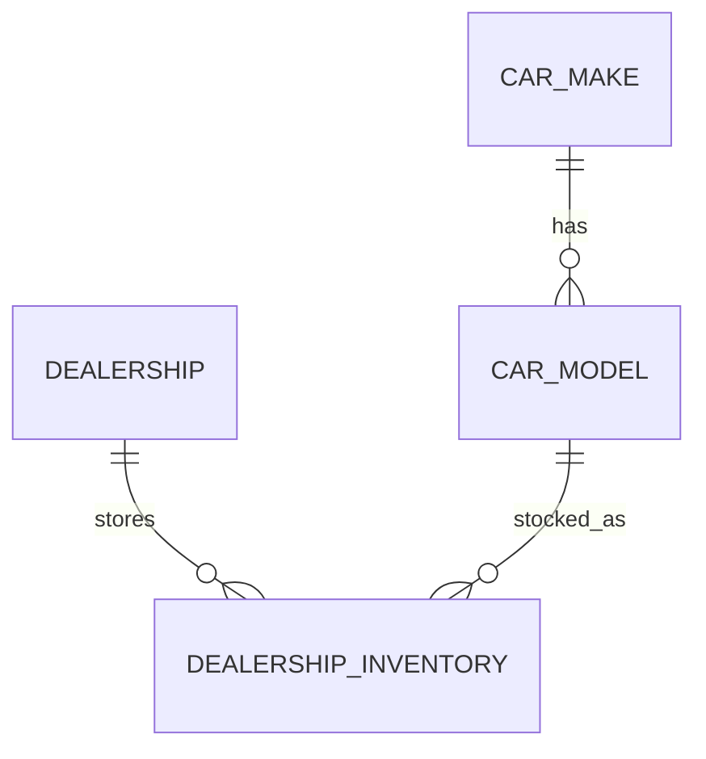

# Теория недели 6: SQL и проектирование реляционной базы данных

Этот конспект рассчитан на первое системное знакомство с SQL. Примеры используют предметную область итогового проекта. Сначала пойми смысл таблиц и запросов, затем запоминай синтаксис.

## 1. Зачем backend-разработчику база данных

Обычный Python-объект живёт в памяти процесса. После завершения программы он исчезает, если данные не были сохранены. База данных решает другие задачи:

- долговременное хранение;
- совместный доступ нескольких процессов;
- поиск и преобразование больших наборов данных;
- защита допустимой структуры и связей;
- атомарное изменение связанных данных;
- восстановление и аудит.

**DBMS** — система управления базами данных. PostgreSQL является реляционной DBMS. Она принимает SQL, проверяет права и ограничения, выбирает план выполнения, читает или изменяет данные и возвращает результат.

SQL — декларативный язык: запрос обычно описывает **какой** результат нужен, а не пошаговый алгоритм обхода строк. Физический способ выполнения выбирает optimizer. Планирование и индексы подробно изучаются на неделе 7.

## 2. Реляционная модель простыми словами

В учебном приближении:

- relation представляется таблицей;
- tuple — строкой;
- attribute — столбцом;
- domain — множеством допустимых значений атрибута.

```text
car_model
+----+--------+--------+--------------+
| id | make   | model  | body_style   |
+----+--------+--------+--------------+
|  1 | Toyota | Camry  | sedan        |
|  2 | Volvo  | XC60   | suv          |
+----+--------+--------+--------------+
```

SQL-таблица практически важна, но не полностью тождественна математическому relation: без ограничения она может содержать duplicate rows, а результат не имеет гарантированного порядка без `ORDER BY`.

## 3. Database, schema и table

**Database** — отдельная база внутри PostgreSQL cluster. Одно server instance может обслуживать несколько databases.

**Schema** — namespace внутри database. Например:

```text
database: dealership_learning
schema:   public
table:    public.car_model
```

Schema помогает группировать объекты и избегать конфликтов имён. На этой неделе достаточно `public`; отдельные application schemas не обязательны.

**Table schema** описывает столбцы, types, defaults и constraints. **Rows** являются данными. DDL меняет структуру, DML — данные.

Условные группы SQL-команд:

- DDL: `CREATE`, `ALTER`, `DROP`, `TRUNCATE`;
- DML: `INSERT`, `UPDATE`, `DELETE`;
- query: `SELECT`;
- transaction control: `BEGIN`, `COMMIT`, `ROLLBACK` — подробно на неделе 7;
- access control: `GRANT`, `REVOKE` — позже.

Это удобная учебная классификация; границы терминов в разных источниках могут немного отличаться.

## 4. SQL statements, identifiers и literals

Statement обычно завершается `;`:

```sql
SELECT id, name
FROM dealership
ORDER BY id;
```

`dealership`, `id`, `name` — identifiers. `'Tbilisi'` — string literal.

В PostgreSQL unquoted identifiers приводятся к lower case. Поэтому удобное правило:

- SQL keywords писать в upper case;
- table/column names — `snake_case` в lower case;
- не создавать имена, требующие двойных кавычек.

```sql
SELECT "MixedCaseColumn" FROM "Order"; -- неудобная схема
SELECT created_at FROM customer_offer;  -- предсказуемая схема
```

Одинарные кавычки обозначают строковые значения, двойные — quoted identifiers. Они не взаимозаменяемы.

Комментарии:

```sql
-- одна строка

/* несколько
   строк */
```

## 5. Выбор data type

Тип ограничивает представление значения и определяет допустимые операции.

### Целые числа

- `smallint` — маленький диапазон;
- `integer` — обычный целый identifier/count;
- `bigint` — большой диапазон.

Количество автомобилей не может быть дробным, поэтому подходит integer type и дополнительный `CHECK`.

### Точные числа

Для денег используют `numeric(precision, scale)`:

```sql
price numeric(12, 2)
```

`numeric` хранит десятичные значения точно в пределах заданной модели. `real` и `double precision` являются approximate floating-point types и не подходят для денежных invariants.

`money` существует в PostgreSQL, но зависит от locale/форматирования и менее удобен для переносимой бизнес-модели. В курсе используем `numeric`.

### Текст

- `text` — строка переменной длины без указанного предела;
- `varchar(n)` — строка с максимальной длиной;
- `char(n)` — фиксированная длина с дополнением пробелами, редко нужна приложению.

Не задавай `varchar(255)` автоматически. Ограничение длины должно выражать реальное правило интерфейса или домена.

### Boolean

```sql
is_active boolean NOT NULL DEFAULT true
```

Boolean имеет `true`, `false` и может иметь `NULL`, если столбец nullable. Если неизвестное третье состояние не нужно, добавь `NOT NULL`.

### Date и time

- `date` — календарная дата;
- `time` — время дня;
- `timestamp without time zone` — дата/время без timezone semantics;
- `timestamp with time zone` (`timestamptz`) — момент времени.

Для `created_at`/`updated_at` backend-системы обычно нужен `timestamptz`:

```sql
created_at timestamptz NOT NULL DEFAULT CURRENT_TIMESTAMP
```

PostgreSQL хранит timezone-aware moments внутренне в UTC и отображает их согласно session timezone. Это не значит, что исходное текстовое имя зоны сохраняется в столбце.

### UUID и identity

Surrogate key может быть integer identity:

```sql
id bigint GENERATED BY DEFAULT AS IDENTITY PRIMARY KEY
```

или `uuid`. UUID полезен, когда identifiers создаются распределённо или не должны быть легко угадываемой последовательностью, но он не нужен автоматически каждой таблице.

Современная SQL-форма identity предпочтительнее механического применения псевдотипа `serial` в новой схеме. В SQLite синтаксис identity другой.

### JSONB

PostgreSQL имеет `jsonb`, но это не повод складывать все поля в один JSON. Стабильные поля, keys и relations лучше моделировать обычными columns/tables. JSONB полезен для действительно гибких дополнительных данных с ясной политикой валидации.

На неделе 6 JSONB не используется в основной схеме.

## 6. `NULL` — неизвестно или неприменимо

`NULL` не является нулём, пустой строкой или `False`. Это отсутствие известного значения.

Примеры:

- `promotion.ends_at IS NULL` может означать «дата завершения не задана»;
- `stock = 0` означает известный нулевой остаток;
- `middle_name = ''` означает известную пустую строку и обычно является плохой моделью неизвестного имени.

SQL использует трёхзначную логику: `TRUE`, `FALSE`, `UNKNOWN`.

```sql
SELECT 5 = NULL;       -- NULL/UNKNOWN
SELECT NULL = NULL;    -- NULL/UNKNOWN
SELECT 5 IS NULL;      -- false
SELECT NULL IS NULL;   -- true
```

Правильно:

```sql
WHERE deleted_at IS NULL
WHERE supplier_id IS NOT NULL
```

`IS DISTINCT FROM` сравнивает значения так, будто `NULL` можно сопоставить предсказуемо:

```sql
SELECT NULL IS NOT DISTINCT FROM NULL; -- true
```

Большинство условий `WHERE` оставляет только rows, для которых выражение равно `TRUE`; `FALSE` и `UNKNOWN` отбрасываются.

`NOT IN` с `NULL` внутри subquery — частая ловушка. Для проверки отсутствия связанных rows обычно надёжнее `NOT EXISTS`.

## 7. Создание таблицы

Пример PostgreSQL:

```sql
CREATE TABLE car_make (
    id bigint GENERATED BY DEFAULT AS IDENTITY PRIMARY KEY,
    name text NOT NULL,
    country_code char(2),
    is_active boolean NOT NULL DEFAULT true,
    created_at timestamptz NOT NULL DEFAULT CURRENT_TIMESTAMP,
    updated_at timestamptz NOT NULL DEFAULT CURRENT_TIMESTAMP,
    CONSTRAINT uq_car_make_name UNIQUE (name),
    CONSTRAINT ck_car_make_country_code
        CHECK (country_code IS NULL OR length(country_code) = 2)
);
```

Хорошая DDL-структура отвечает на вопросы:

- как row идентифицируется;
- какие значения обязательны;
- какие значения уникальны;
- какие диапазоны допустимы;
- какие связи должны существовать;
- что происходит при удалении связанной row.

`CREATE TABLE IF NOT EXISTS` удобен для некоторых bootstrap scripts, но может скрыть несовпадение ожидаемой и фактической схемы. Migration system должен знать точное состояние, а не молча пропускать отличия.

## 8. Изменение и удаление структуры

```sql
ALTER TABLE car_make
ADD COLUMN website text;

ALTER TABLE car_make
DROP COLUMN website;
```

`DROP TABLE` удаляет структуру и данные. `DROP ... CASCADE` может удалить зависимые объекты и не должен использоваться без просмотра зависимостей.

На практике изменение production schema выполняется миграциями, с планом совместимости и восстановления. На неделе 6 DDL применяется только к одноразовой учебной базе.

## 9. Constraints — правила внутри БД

Application validation улучшает сообщения пользователю, но concurrent или другой клиент может обойти её. Database constraints являются последней общей границей целостности.

### `NOT NULL`

```sql
name text NOT NULL
```

Гарантирует наличие значения, но не запрещает пустую строку.

### `UNIQUE`

```sql
CONSTRAINT uq_dealership_name_country UNIQUE (name, country_code)
```

Уникальна комбинация, а не обязательно каждый столбец отдельно. Поведение нескольких `NULL` зависит от DBMS и выбранной формы constraint; в PostgreSQL обычный `UNIQUE` по умолчанию допускает несколько `NULL`.

### `CHECK`

```sql
quantity integer NOT NULL,
CONSTRAINT ck_inventory_quantity CHECK (quantity >= 0)
```

`CHECK` считается выполненным при `TRUE` или `UNKNOWN`, поэтому для обязательного значения одновременно нужен `NOT NULL`.

`CHECK` должен проверять текущую row. Cross-row и cross-table invariant нельзя надёжно выражать обычным PostgreSQL `CHECK`.

### `DEFAULT`

```sql
status text NOT NULL DEFAULT 'pending'
```

Default применяется, когда column не указана или явно используется `DEFAULT`. Он не исправляет переданный `NULL`.

### Named constraints

Осмысленное имя улучшает диагностику и миграции:

```sql
CONSTRAINT ck_offer_max_price_positive CHECK (max_price > 0)
```

## 10. Primary, natural и surrogate keys

**Primary key** однозначно идентифицирует row, всегда `UNIQUE` и `NOT NULL`.

**Natural key** уже имеет бизнес-смысл: VIN, ISO country code. Он полезен, если действительно стабилен и уникален.

**Surrogate key** создан системой: identity integer или UUID. Он не заменяет business uniqueness:

```sql
id bigint GENERATED BY DEFAULT AS IDENTITY PRIMARY KEY,
email text NOT NULL,
CONSTRAINT uq_user_email UNIQUE (email)
```

Если оставить только `id`, дубли email будут технически разными rows, хотя бизнес-правило запрещает их.

Composite primary key подходит bridge table:

```sql
PRIMARY KEY (dealership_id, car_model_id)
```

Отдельный surrogate id для bridge table нужен, если на связь будут ссылаться другие tables или у самой связи есть самостоятельный lifecycle. Но business uniqueness пары всё равно фиксируется `UNIQUE`.

## 11. Foreign key и referential integrity

```sql
CREATE TABLE car_model (
    id bigint GENERATED BY DEFAULT AS IDENTITY PRIMARY KEY,
    make_id bigint NOT NULL REFERENCES car_make(id),
    name text NOT NULL
);
```

Foreign key гарантирует: ненулевой `make_id` ссылается на существующую row `car_make`.

Термины:

- referenced/parent table — `car_make`;
- referencing/child table — `car_model`;
- referenced key должен быть primary/unique подходящей формы.

Foreign key не создаёт автоматически индекс на referencing column в PostgreSQL. Индексирование будет обсуждаться на неделе 7.

## 12. Cardinality: one-to-one, one-to-many, many-to-many

### One-to-many

Одна марка имеет много моделей; каждая модель относится к одной марке:

```text
car_make 1 ─────< car_model
```

FK находится на стороне many: `car_model.make_id`.

### One-to-one

Один user имеет не более одного buyer profile:

```sql
user_id bigint PRIMARY KEY REFERENCES app_user(id)
```

или foreign key с `UNIQUE`. Один только FK создаёт one-to-many, а не one-to-one.

### Many-to-many

Автосалон хранит много моделей, одна модель присутствует во многих салонах. Нужна bridge table:

```sql
CREATE TABLE dealership_inventory (
    dealership_id bigint NOT NULL REFERENCES dealership(id),
    car_model_id bigint NOT NULL REFERENCES car_model(id),
    quantity integer NOT NULL,
    sale_price numeric(12, 2) NOT NULL,
    PRIMARY KEY (dealership_id, car_model_id)
);
```

Строка bridge table является отношением и может хранить собственные attributes: quantity, price, timestamps.

Нельзя хранить `"1,7,15"` или JSON-массив identifiers вместо many-to-many без серьёзной причины: БД теряет referential integrity и удобные joins.

## 13. Optionality и минимальная/максимальная cardinality

`NOT NULL` на foreign key означает, что child обязан иметь parent. Nullable FK допускает отсутствие связи.

ERD должна отражать минимум и максимум:

```text
dealership ||--o{ dealership_inventory
```

В Mermaid ER notation это читается как «один dealership связан с нулём или многими inventory rows; каждая inventory row связана ровно с одним dealership».

Не выбирай nullable автоматически. Спроси: может ли объект существовать в валидном состоянии без этой связи?

## 14. Referential actions

При удалении parent row foreign key выбирает поведение:

- `RESTRICT`/`NO ACTION` — запретить нарушение связи;
- `CASCADE` — удалить/изменить dependent rows;
- `SET NULL` — убрать ссылку, если column nullable;
- `SET DEFAULT` — установить default, который также должен быть valid.

```sql
supplier_id bigint NOT NULL
    REFERENCES supplier(id)
    ON DELETE RESTRICT
```

`CASCADE` не является удобной кнопкой «починить ошибку FK». Для sale, purchase и ledger history обычно важно не потерять запись. Часто entity деактивируют, а историческая row сохраняет foreign key и snapshot цены.

## 15. Деньги, количество, время и soft deletion

### Деньги

В задании валюта одна — USD. Минимальная модель:

```sql
amount numeric(14, 2) NOT NULL CHECK (amount >= 0)
```

Для истории сделки сохраняют agreed `unit_price`, discount и total как snapshot. Нельзя пересчитывать старую покупку по текущей цене каталога.

### Количество

```sql
quantity integer NOT NULL CHECK (quantity >= 0)
```

Для строки сделки `quantity > 0`, для текущего остатка допустим `0`. Это разные constraints.

### Время

`created_at` можно заполнить default. `updated_at DEFAULT CURRENT_TIMESTAMP` сам по себе не обновляется при каждом `UPDATE`; это делает application/migration framework или trigger. Triggers будут позже.

### `is_active`

Исходное задание требует `is_active`, `created_at`, `updated_at` для моделей. Это можно выразить в прототипе, но `is_active` не решает всё:

- unique constraint продолжает видеть inactive rows;
- foreign keys продолжают ссылаться на row;
- каждый query должен осознанно учитывать inactive rows;
- financial/audit rows обычно не «удаляются», а имеют immutable semantics или отдельный status.

Поэтому в `DESIGN_DECISIONS.md` нужно записать назначение `is_active` для directory entities и отдельно политику исторических transactions.

## 16. `INSERT`

Всегда перечисляй columns:

```sql
INSERT INTO car_make (name, country_code)
VALUES ('Toyota', 'JP');
```

Несколько rows:

```sql
INSERT INTO car_make (name, country_code)
VALUES
    ('Volvo', 'SE'),
    ('BMW', 'DE');
```

PostgreSQL `RETURNING` возвращает созданные/изменённые значения:

```sql
INSERT INTO car_make (name, country_code)
VALUES ('Kia', 'KR')
RETURNING id, name;
```

Не полагайся на физический порядок rows после insertion.

## 17. `UPDATE`

```sql
UPDATE dealership_inventory
SET sale_price = 32000.00,
    updated_at = CURRENT_TIMESTAMP
WHERE dealership_id = 1
  AND car_model_id = 2
RETURNING dealership_id, car_model_id, sale_price;
```

Без `WHERE` обновятся все rows. Безопасный учебный workflow:

1. написать `SELECT` с тем же predicate;
2. проверить identifiers и количество rows;
3. только затем выполнить `UPDATE`;
4. проверить `RETURNING` или повторный `SELECT`;
5. на реальной системе использовать transaction и backup/migration plan.

`SET price = price * 0.9` повторно меняет значение ещё раз. Идемпотентность DML зависит от выражения, а не от слова `UPDATE`.

## 18. `DELETE` и `TRUNCATE`

```sql
DELETE FROM temporary_offer
WHERE status = 'expired'
RETURNING id;
```

`DELETE`:

- может иметь `WHERE`;
- обрабатывает выбранные rows;
- поддерживает `RETURNING` в PostgreSQL;
- запускает `ON DELETE` triggers;
- участвует в referential actions.

`TRUNCATE`:

- быстро очищает всю table;
- не имеет row predicate;
- берёт сильную lock;
- не запускает обычные `ON DELETE` triggers;
- может отдельно reset identity;
- с `CASCADE` способен очистить referencing tables.

На учебной неделе `TRUNCATE` изучается теоретически и допускается только в явно одноразовой базе после проверки exact target. Он не является синонимом `DELETE FROM ... WHERE ...`.

## 19. SQL injection и параметры

Нельзя собирать SQL из пользовательского текста:

```python
# Небезопасно
query = "SELECT * FROM car_model WHERE name = '" + user_input + "'"
```

Application передаёт SQL template и parameters отдельно средствами database driver:

```python
cursor.execute(
    "SELECT id, name FROM car_model WHERE name = ?",
    (user_input,),
)
```

Placeholder зависит от driver: `?`, `%s`, `$1` — это не повод форматировать строку самостоятельно. Parameters защищают **значения**, но имя table, column или направление сортировки обычно нельзя передать обычным value parameter. Такие структурные элементы выбирают из server-side allowlist.

В `.sql` упражнениях используются фиксированные учебные literals. В будущем Python/Django всегда применяет parameter binding ORM/driver.

## 20. `SELECT` и логический порядок обработки

Читаем запрос сверху вниз, но полезно понимать логическую модель:

```text
FROM/JOIN
→ WHERE
→ GROUP BY
→ aggregates
→ HAVING
→ window functions
→ SELECT
→ DISTINCT
→ ORDER BY
→ LIMIT/OFFSET
```

Это учебная логическая последовательность, не физический execution plan. Optimizer может перестраивать безопасные операции, сохраняя semantics.

Отсюда следствия:

- alias из `SELECT` обычно недоступен в `WHERE` того же уровня;
- `WHERE` фильтрует rows до grouping;
- `HAVING` фильтрует groups после grouping;
- window function нельзя использовать напрямую в `WHERE` того же query level;
- итоговый порядок гарантирует только top-level `ORDER BY`.

## 21. Projection, aliases и `DISTINCT`

```sql
SELECT id, name, country_code
FROM dealership;
```

Projection выбирает columns/expressions. В application queries лучше явно перечислять columns, а не использовать `SELECT *`: contract становится понятнее и не меняется неожиданно при добавлении column.

Aliases:

```sql
SELECT
    d.name AS dealership_name,
    d.balance AS available_balance
FROM dealership AS d;
```

`DISTINCT` удаляет duplicate result rows:

```sql
SELECT DISTINCT country_code
FROM dealership
ORDER BY country_code;
```

Он не исправляет неверный join. Если query внезапно потребовал `DISTINCT`, сначала проверь cardinality связей.

## 22. `WHERE`: filtering и predicates

```sql
SELECT id, name, balance
FROM dealership
WHERE is_active = true
  AND balance >= 100000.00
ORDER BY id;
```

Полезные формы:

```sql
WHERE price BETWEEN 20000 AND 40000       -- границы включены
WHERE status IN ('pending', 'processing')
WHERE name LIKE 'Toy%'
WHERE ends_at IS NULL
WHERE NOT is_active
```

Скобки делают сочетание `AND`/`OR` явным:

```sql
WHERE is_active = true
  AND (country_code = 'GE' OR country_code = 'AM')
```

Без скобок `AND` имеет более высокий precedence, чем `OR`. Не полагайся на память читателя в важном business predicate.

`LIKE` обычно учитывает регистр согласно collation; PostgreSQL имеет `ILIKE` как case-insensitive extension. Это отличие от SQLite и других DBMS нужно помечать.

## 23. `ORDER BY`, `LIMIT` и `OFFSET`

```sql
SELECT id, name, balance
FROM dealership
ORDER BY balance DESC, id ASC
LIMIT 10 OFFSET 0;
```

Правила:

- без `ORDER BY` row order не гарантирован;
- tie-breaker (`id`) делает порядок стабильнее;
- `LIMIT` без уникально определённого порядка даёт непредсказуемую страницу;
- большой `OFFSET` может быть дорогим, потому что пропущенные rows всё равно вычисляются;
- keyset pagination изучается позже вместе с индексами/API.

`NULLS FIRST`/`NULLS LAST` в PostgreSQL задаёт положение `NULL` явно:

```sql
ORDER BY ends_at ASC NULLS LAST
```

## 24. Expressions, `CASE`, `COALESCE` и casts

```sql
SELECT
    id,
    quantity,
    CASE
        WHEN quantity = 0 THEN 'out_of_stock'
        WHEN quantity < 3 THEN 'low_stock'
        ELSE 'available'
    END AS stock_status
FROM dealership_inventory;
```

`CASE` возвращает expression, а не выполняет imperative branch Python.

`COALESCE(a, b, c)` возвращает первое non-null значение:

```sql
SELECT COALESCE(display_name, legal_name, 'Unknown')
FROM supplier;
```

Он не должен маскировать data-quality problem. Если `legal_name` обязательно, лучше `NOT NULL`, а не вечный fallback.

Cast:

```sql
SELECT quantity::numeric / 30 AS daily_rate
FROM sales_summary;
```

Форма `CAST(quantity AS numeric)` переносимее. Integer division и cast behavior различаются между DBMS, поэтому расчёт rates проверяется на целевой PostgreSQL.

## 25. Join как сочетание relations

### `INNER JOIN`

Оставляет только совпавшие pairs:

```sql
SELECT
    m.name AS model_name,
    k.name AS make_name
FROM car_model AS m
JOIN car_make AS k ON k.id = m.make_id
ORDER BY m.id;
```

### `LEFT JOIN`

Сохраняет все left rows; при отсутствии совпадения right columns становятся `NULL`:

```sql
SELECT
    d.name,
    i.quantity
FROM dealership AS d
LEFT JOIN dealership_inventory AS i
    ON i.dealership_id = d.id
ORDER BY d.id, i.car_model_id;
```

### `RIGHT JOIN`

Сохраняет все right rows. Часто query можно переписать как более привычный `LEFT JOIN`, поменяв tables местами.

### `FULL OUTER JOIN`

Сохраняет rows обеих сторон: совпавшие объединяются, несовпавшие дополняются `NULL`. Полезен для reconciliation двух наборов.

### `CROSS JOIN`

Создаёт Cartesian product: каждая left row с каждой right row. Для N и M rows получается N × M rows.

`CROSS JOIN` иногда нужен намеренно, например построить все комбинации dealership × reporting month. Случайный Cartesian product — ошибка.

## 26. Cardinality и fan-out

До join запиши:

- сколько rows в каждой table;
- максимальное число matches на одну left row;
- какие left/right rows могут отсутствовать;
- ожидаемый диапазон result row count.

Если dealership имеет 2 inventory rows и каждая модель имеет 3 supplier offers, join создаёт до 6 rows. Добавление sales rows может умножить результат ещё раз. Aggregate после нескольких one-to-many joins способен посчитать сумму повторно.

Решения fan-out problem:

- агрегировать каждую detail table до нужного grain до join;
- использовать correlated subquery/CTE;
- чётко определить grain результата;
- не лечить неверные суммы случайным `DISTINCT`.

**Grain** — что представляет одна row результата. Например: «одна row на dealership» или «одна row на dealership и model».

## 27. Условие outer join: `ON` против `WHERE`

Нужно оставить все dealerships, но присоединить только активный inventory:

```sql
SELECT d.id, i.car_model_id
FROM dealership AS d
LEFT JOIN dealership_inventory AS i
    ON i.dealership_id = d.id
   AND i.is_active = true;
```

Если написать:

```sql
LEFT JOIN dealership_inventory AS i ON i.dealership_id = d.id
WHERE i.is_active = true;
```

rows без inventory получат `i.is_active = NULL`; `WHERE` отбросит их. Результат станет похож на `INNER JOIN`. Иногда это нужно, но решение должно быть осознанным.

## 28. Self join

Table можно присоединить к самой себе. Например, иерархия категории:

```sql
SELECT child.name, parent.name AS parent_name
FROM category AS child
LEFT JOIN category AS parent ON parent.id = child.parent_id;
```

Aliases обязательны для различения ролей. В основном проекте self join не нужен в первой схеме, но важно понимать принцип.

## 29. Subquery

Non-correlated scalar subquery вычисляет самостоятельный результат:

```sql
SELECT id, name, balance
FROM dealership
WHERE balance > (
    SELECT AVG(balance)
    FROM dealership
);
```

Scalar subquery обязан вернуть не более одной row и один column. Ноль rows обычно даёт `NULL`; несколько rows вызывают ошибку.

Derived table в `FROM`:

```sql
SELECT summary.dealership_id, summary.total_sales
FROM (
    SELECT dealership_id, SUM(total_amount) AS total_sales
    FROM retail_sale
    GROUP BY dealership_id
) AS summary
WHERE summary.total_sales > 100000;
```

Subquery не «хуже join» автоматически. Выбирай форму, которая правильно выражает grain и проверяемый шаг.

## 30. `EXISTS`, `IN` и correlated subquery

`EXISTS` проверяет наличие хотя бы одной row:

```sql
SELECT d.id, d.name
FROM dealership AS d
WHERE EXISTS (
    SELECT 1
    FROM dealership_inventory AS i
    WHERE i.dealership_id = d.id
      AND i.quantity > 0
);
```

Inner query correlated: она ссылается на `d.id` outer query.

`IN` удобен для membership:

```sql
WHERE car_model_id IN (
    SELECT car_model_id
    FROM customer_preference
    WHERE customer_id = 10
)
```

Для «нет связи» предпочитай `NOT EXISTS`, если subquery может вернуть `NULL`. `NOT IN (1, NULL)` не становится просто «не 1»: unknown logic способна убрать все rows.

## 31. CTE — именованный шаг запроса

```sql
WITH active_inventory AS (
    SELECT dealership_id, car_model_id, quantity
    FROM dealership_inventory
    WHERE is_active = true
      AND quantity > 0
)
SELECT dealership_id, COUNT(*) AS available_models
FROM active_inventory
GROUP BY dealership_id
ORDER BY dealership_id;
```

CTE делает сложный query читаемым и позволяет переиспользовать результат внутри statement. Он не является автоматически temporary table и не гарантирует ускорение.

PostgreSQL может inline или materialize non-recursive side-effect-free CTE в зависимости от запроса и hints. Performance проверяется plan, а не мифом «CTE всегда быстрее/медленнее».

Recursive CTE способен обходить hierarchy. На этой неделе достаточно понять anchor query, recursive step и termination; сложная рекурсия не оценивается.

## 32. Set operations

```sql
SELECT customer_id FROM retail_sale_2025
UNION
SELECT customer_id FROM retail_sale_2026;
```

- `UNION` объединяет и удаляет duplicates;
- `UNION ALL` сохраняет duplicates и обычно выполняет меньше работы;
- `INTERSECT` оставляет общие rows;
- `EXCEPT` оставляет rows первой части, отсутствующие во второй.

Каждая часть должна возвращать одинаковое количество совместимых columns. Итоговый `ORDER BY` относится ко всему combined result.

## 33. Aggregate functions

Aggregate превращает набор rows в одно значение на group:

- `COUNT(*)` — rows;
- `COUNT(column)` — non-null values;
- `SUM` — сумма;
- `AVG` — среднее;
- `MIN`, `MAX` — минимум/максимум.

```sql
SELECT
    dealership_id,
    COUNT(*) AS sale_count,
    COUNT(DISTINCT customer_id) AS unique_customers,
    SUM(total_amount) AS revenue
FROM retail_sale
GROUP BY dealership_id;
```

`SUM` по пустому набору обычно возвращает `NULL`, а `COUNT(*)` — `0`. Если contract требует zero:

```sql
COALESCE(SUM(total_amount), 0)
```

Но сначала реши, что в домене означает отсутствие rows.

## 34. `GROUP BY` и `HAVING`

Каждый selected column, не находящийся внутри aggregate, должен соответствовать group semantics:

```sql
SELECT dealership_id, SUM(total_amount) AS revenue
FROM retail_sale
WHERE sold_at >= DATE '2026-01-01'
GROUP BY dealership_id
HAVING SUM(total_amount) >= 100000
ORDER BY revenue DESC, dealership_id;
```

- `WHERE` выбирает отдельные sales до grouping;
- `GROUP BY` создаёт одну group на dealership;
- `HAVING` выбирает уже созданные groups.

Не используй `HAVING` как привычную замену `WHERE`: смысл и возможная стоимость отличаются.

## 35. Aggregate после join

Чтобы показать dealerships без sales, используют `LEFT JOIN`, но placement условий важно:

```sql
SELECT
    d.id,
    d.name,
    COUNT(s.id) AS sale_count,
    COALESCE(SUM(s.total_amount), 0) AS revenue
FROM dealership AS d
LEFT JOIN retail_sale AS s
    ON s.dealership_id = d.id
   AND s.sold_at >= DATE '2026-01-01'
GROUP BY d.id, d.name
ORDER BY d.id;
```

`COUNT(*)` здесь дал бы минимум 1 на dealership из-за сохранённой left row. Для количества sales нужен `COUNT(s.id)`.

## 36. Window functions: расчёт без схлопывания rows

Aggregate с `GROUP BY` уменьшает число rows. Window function сохраняет detail rows и добавляет вычисление по связанному окну.

```sql
SELECT
    dealership_id,
    sold_at,
    total_amount,
    SUM(total_amount) OVER (
        PARTITION BY dealership_id
    ) AS dealership_total
FROM retail_sale
ORDER BY dealership_id, sold_at, id;
```

Каждая sale остаётся в результате, но получает общий total своего dealership.

Части `OVER`:

- `PARTITION BY` делит rows на независимые groups окна;
- `ORDER BY` задаёт последовательность внутри partition;
- frame определяет, какие соседние rows участвуют для текущей row.

Top-level `ORDER BY` всё равно нужен для гарантированного порядка результата.

## 37. Ranking functions

```sql
SELECT
    supplier_id,
    car_model_id,
    price,
    ROW_NUMBER() OVER (
        PARTITION BY car_model_id
        ORDER BY price ASC, supplier_id ASC
    ) AS position
FROM supplier_catalog_item;
```

- `ROW_NUMBER()` даёт уникальный последовательный номер;
- `RANK()` оставляет gap после ties: `1, 1, 3`;
- `DENSE_RANK()` не оставляет gap: `1, 1, 2`.

Если нужно ровно одно deterministic предложение на модель, `ROW_NUMBER()` требует complete tie-breaker. Если нужны все поставщики с равной минимальной ценой, подходит rank или сравнение с `MIN`.

Window alias нельзя отфильтровать в `WHERE` того же query level. Нужна subquery/CTE:

```sql
WITH ranked AS (
    SELECT
        item.*,
        ROW_NUMBER() OVER (
            PARTITION BY car_model_id
            ORDER BY price, supplier_id
        ) AS position
    FROM supplier_catalog_item AS item
)
SELECT *
FROM ranked
WHERE position = 1;
```

## 38. `LAG`, `LEAD`, first и last

`LAG` читает предыдущую row по window order:

```sql
SELECT
    dealership_id,
    sold_at,
    total_amount,
    LAG(total_amount) OVER (
        PARTITION BY dealership_id
        ORDER BY sold_at, id
    ) AS previous_amount
FROM retail_sale;
```

`LEAD` смотрит вперёд. Они полезны для сравнения соседних значений, но first row partition не имеет предыдущей и получает `NULL`.

`FIRST_VALUE`/`LAST_VALUE` зависят от frame. `LAST_VALUE` с default frame часто возвращает значение текущей peer group, а не последнюю row всего partition. Поэтому frame нужно задавать осознанно.

## 39. Window frame

Running total:

```sql
SUM(total_amount) OVER (
    PARTITION BY dealership_id
    ORDER BY sold_at, id
    ROWS BETWEEN UNBOUNDED PRECEDING AND CURRENT ROW
)
```

Total всего partition:

```sql
SUM(total_amount) OVER (
    PARTITION BY dealership_id
    ROWS BETWEEN UNBOUNDED PRECEDING AND UNBOUNDED FOLLOWING
)
```

`ROWS` считает физические rows относительно текущей позиции. `RANGE` объединяет peers по ordering value и имеет другие semantics. На старте для running calculation обычно понятнее явный `ROWS` frame и deterministic order.

## 40. Views

View сохраняет query definition и выглядит для чтения как table:

```sql
CREATE VIEW active_dealership_inventory AS
SELECT dealership_id, car_model_id, quantity, sale_price
FROM dealership_inventory
WHERE is_active = true;
```

Обычная view обычно не хранит snapshot результата. При обращении PostgreSQL использует её query с актуальными base tables.

Польза:

- единое имя для повторяемого query;
- ограниченный стабильный read contract;
- сокрытие части columns;
- упрощение потребителей.

View не является автоматическим performance cache. Изменяемость view ограничена формой query; сложные aggregate views обычно не обновляются напрямую.

## 41. Materialized views

Materialized view сохраняет result физически:

```sql
CREATE MATERIALIZED VIEW dealership_sales_summary AS
SELECT
    dealership_id,
    COUNT(*) AS sale_count,
    SUM(total_amount) AS revenue
FROM retail_sale
GROUP BY dealership_id;
```

Base data меняется, materialized view остаётся прежней до refresh:

```sql
REFRESH MATERIALIZED VIEW dealership_sales_summary;
```

Trade-off:

- чтение сложного отчёта может стать дешевле;
- данные могут быть stale;
- refresh требует ресурсов и coordination;
- storage дублируется;
- concurrent refresh имеет дополнительные prerequisites.

В первой версии итогового проекта статистика может быть обычным query. Materialized view добавляется только после измерения и определения допустимой свежести.

SQLite не поддерживает PostgreSQL materialized views; день 6 описывает PostgreSQL DDL отдельно.

## 42. Что такое normalization

Normalization уменьшает нежелательное дублирование и anomalies изменения. Цель не «создать максимум таблиц», а хранить каждый независимый факт в понятном месте.

Плохая таблица:

```text
sale(
  sale_id,
  customer_email,
  customer_name,
  dealership_name,
  dealership_country,
  car_make,
  car_model,
  quantity,
  unit_price
)
```

Проблемы:

- update anomaly: email клиента меняется во многих sales;
- insert anomaly: нельзя добавить dealership без sale;
- delete anomaly: удаление последней sale может удалить единственные сведения о dealership;
- inconsistent duplicates: `Toyota` и `TOYOTA` как разные тексты.

Исторический snapshot — важное исключение. `unit_price` в sale намеренно копирует согласованную цену, потому что исторический факт не должен меняться вслед за каталогом.

## 43. Первая нормальная форма

Практический смысл 1NF:

- каждая cell содержит одно значение выбранного domain;
- нет repeating groups вида `car_1`, `car_2`, `car_3`;
- каждая row однозначно идентифицируема.

Плохо:

```text
dealership.preferred_car_ids = "1,4,9"
```

Лучше:

```text
dealership_preference(dealership_id, car_model_id)
```

«Atomic» зависит от требуемых операций. Полный адрес иногда хранится строкой, если части не фильтруются; country code выделяется, если по нему нужен поиск и constraint.

## 44. Вторая нормальная форма

2NF важна для composite keys: каждый non-key attribute должен зависеть от **всего** candidate key, а не от его части.

```text
dealership_inventory(
  dealership_id,
  car_model_id,
  dealership_name,   -- зависит только от dealership_id
  model_name,        -- зависит только от car_model_id
  quantity           -- зависит от пары
)
```

`dealership_name` хранится в `dealership`, `model_name` — в `car_model`, а `quantity` остаётся в bridge table.

Если table имеет простой single-column key, partial dependency на часть composite key неприменима, но другие anomalies всё ещё возможны.

## 45. Третья нормальная форма

Упрощённо: non-key attribute не должен зависеть от другого non-key attribute, если это отдельный самостоятельный факт.

```text
supplier(
  supplier_id,
  country_code,
  country_name
)
```

Если `country_name` полностью определяется `country_code`, справочник country хранит соответствие отдельно или application использует стандартный источник. Иначе переименование страны приходится менять во многих rows.

Нормальные формы формально определяются через functional dependencies и candidate keys. На этой неделе требуется практический анализ зависимостей, а не доказательства.

## 46. Осознанная denormalization

Denormalization намеренно дублирует или предварительно вычисляет данные ради конкретной цели:

- snapshot согласованной цены сделки;
- materialized summary для дорогого отчёта;
- cached best supplier choice;
- denormalized counter.

Перед добавлением ответь:

1. Какой измеренный query или contract этого требует?
2. Какой источник истины?
3. Когда и кем обновляется копия?
4. Что происходит при частичном сбое?
5. Как обнаружить и исправить рассогласование?

Если ответов нет, дублирование преждевременно.

`BestSupplierChoice` из проектного roadmap — derived/cached relation. На первой ERD нужно отметить её как производную, а не путать с источником supplier prices.

## 47. ER-диаграмма

ERD показывает entities, attributes, keys и relationships. На этой неделе используем Mermaid `erDiagram`.



Основные маркеры:

- `||` — ровно один;
- `o|` — ноль или один;
- `|{` — один или много;
- `o{` — ноль или много.

Diagram — не украшение. Она должна совпадать с DDL:

- each entity ↔ table;
- PK/FK видны;
- optionality совпадает с `NULL`/`NOT NULL`;
- one-to-one имеет uniqueness;
- many-to-many имеет bridge table.

## 48. Из требований проекта к entities

Текстовое требование не определяет готовую table. Например «автосалон хранит список авто и количество» превращается в:

```text
dealership
car_make
car_model
dealership_inventory(dealership_id, car_model_id, quantity, sale_price)
```

«Поставщик имеет список авто с ценами»:

```text
supplier
supplier_catalog_item(supplier_id, car_model_id, base_price, quantity)
```

«Покупатель создаёт Offer»:

```text
customer
customer_offer(customer_id, car_model_id, max_price, status)
```

«История продаж» — отдельная immutable business record, а не список внутри dealership:

```text
retail_sale(customer_id, dealership_id, car_model_id,
            quantity, unit_price, discount_amount, total_amount, sold_at)
```

## 49. Сущности первой ERD

Минимальный кандидатный набор:

- `app_user`;
- `customer_profile`;
- `dealership`;
- `supplier`;
- `car_make`;
- `car_model`;
- `dealership_preference`;
- `customer_preference`;
- `dealership_inventory`;
- `supplier_catalog_item`;
- `promotion`;
- `promotion_car_model`;
- `supplier_loyalty_discount`;
- `customer_offer`;
- `retail_sale`;
- `procurement`;
- `stock_movement`;
- `balance_entry`;
- `best_supplier_choice` как derived cache;
- `background_job_run` как будущий audit.

Это не приказ создать все tables в день 1. Ученик сначала определяет grain и lifecycle каждой сущности, затем сокращает или уточняет набор.

## 50. Сложные места предметной области

### User и роли

Можно иметь `app_user` с role и отдельные profile tables. Нужно решить, может ли один user одновременно быть представителем dealership/supplier и покупателем. От этого зависит one-to-one или более гибкая модель membership.

### Promotions

Требования упоминают акции автосалонов и поставщиков. Одна polymorphic table с парой nullable foreign keys часто создаёт слабые constraints. На первом этапе допустимы отдельные dealership/supplier promotion tables или чётко ограниченная общая модель с явным scope.

### Prices

Текущая catalog price и agreed transaction price — разные facts. История должна хранить snapshot.

### Stock

Current quantity и stock movements связаны, но их consistency является transaction/concurrency problem недели 7. На неделе 6 нужно только выделить tables и constraints `quantity >= 0`.

### Soft deletion

Исходный документ требует `is_active` для каждой модели. Для mutable catalogs это естественно. Для financial history физическое удаление и «деактивация» требуют отдельной audit policy. В прототипе поле сохраняется ради требования, а `DESIGN_DECISIONS.md` фиксирует, что transaction rows не должны исчезать или менять экономический смысл.

### Location

Для country достаточно `country_code char(2)`/справочника на этом этапе. `django-countries` и PostGIS относятся к application/geo этапам; PostGIS не нужен только ради страны.

## 51. Какие invariants защищает database

Хорошие кандидаты:

- price/amount неотрицательны;
- transaction quantity положительно;
- inventory quantity неотрицательно;
- email/identifier уникален согласно нормализованной политике;
- status принадлежит допустимому набору;
- promotion end не раньше start;
- every FK указывает на существующую row;
- одна inventory row на dealership + model;
- одна supplier catalog row на supplier + model;
- одна offer завершается не более одного раза — частично constraint/state model, полностью transaction logic позже.

Не каждый invariant выражается row-level constraint. «Баланс и остаток изменяются вместе» требует transaction; «лучшая цена среди всех поставщиков» требует query/service, а не простой `CHECK`.

## 52. Что должно быть в итоговом прототипе

```text
schema_postgresql.sql
  tables, types, keys, constraints, comments

seed_postgresql.sql
  небольшой согласованный dataset

queries_postgresql.sql
  business reads и reports

checks_postgresql.sql
  запросы, показывающие invariants и ожидаемые failures

ERD.md
  диаграмма и описание cardinality

DESIGN_DECISIONS.md
  спорные решения, alternatives и deferred topics
```

Минимальные business queries:

1. доступный каталог автосалона;
2. поставщики модели с effective price;
3. лучший поставщик по каждой модели;
4. подходящие dealerships для Offer;
5. продажи и revenue dealership;
6. unique customers dealership;
7. расходы и покупки customer;
8. supplier sales и partner dealerships;
9. running revenue;
10. top model per dealership.

## 53. Типичные ошибки недели

1. Table называют просто списком без row grain.
2. Primary key считают номером строки на экране.
3. Surrogate id используют вместо business uniqueness.
4. One-to-one создают обычным non-unique FK.
5. Many-to-many хранят CSV-строкой.
6. `NULL` путают с нулём.
7. Пишут `column = NULL`.
8. `CHECK` без `NOT NULL` считают запретом `NULL`.
9. Деньги хранят в `double precision`.
10. `updated_at DEFAULT now()` считают автоматическим обновлением.
11. Каждому FK назначают `CASCADE` без анализа.
12. `UPDATE`/`DELETE` выполняют до preview `SELECT`.
13. `TRUNCATE` считают просто быстрым `DELETE`.
14. Используют `SELECT *` как стабильный API contract.
15. Ожидают порядок без `ORDER BY`.
16. Pagination не имеет tie-breaker.
17. `DISTINCT` скрывает неверный join.
18. `LEFT JOIN` ломают фильтром right table в `WHERE`.
19. Не прогнозируют fan-out.
20. `COUNT(*)` после `LEFT JOIN` считают количеством child rows.
21. `WHERE` и `HAVING` меняют местами.
22. Aggregate и window function считают одинаковыми.
23. `ROW_NUMBER()` не имеет deterministic tie-breaker.
24. Running total не задаёт понятный frame.
25. `NOT IN` с nullable subquery даёт неожиданный UNKNOWN.
26. CTE считают обязательной materialization.
27. View считают сохранённым snapshot.
28. Materialized view считают всегда актуальной.
29. Normalization превращают в механическое дробление tables.
30. Denormalization добавляют без source of truth и refresh policy.
31. ERD рисуют отдельно от DDL и не сверяют.
32. Историческую цену читают из текущего каталога.

## 54. Контрольные прогнозы

Сначала ответь письменно, потом проверяй на учебной базе.

### Прогноз 1. `NULL`

Какие rows выберет `WHERE ends_at = NULL`? Чем заменить условие?

### Прогноз 2. `CHECK`

Пропустит ли `CHECK (price > 0)` значение `NULL`, если нет `NOT NULL`?

### Прогноз 3. Unique pair

Могут ли два разных dealership иметь inventory одной модели при `UNIQUE (dealership_id, car_model_id)`?

### Прогноз 4. `LEFT JOIN`

Что произойдёт с dealership без inventory, если написать `WHERE inventory.is_active = true`?

### Прогноз 5. Cartesian product

Сколько rows даст `CROSS JOIN` tables из 3 и 4 rows?

### Прогноз 6. `COUNT`

Чем отличаются `COUNT(*)`, `COUNT(discount)` и `COUNT(DISTINCT customer_id)`?

### Прогноз 7. `HAVING`

Можно ли через `WHERE SUM(total_amount) > 1000` фильтровать groups того же query level?

### Прогноз 8. Window

Уменьшит ли `SUM(amount) OVER (PARTITION BY customer_id)` число result rows?

### Прогноз 9. Ranking ties

Какие numbers дадут `ROW_NUMBER`, `RANK`, `DENSE_RANK` для равных первых двух цен?

### Прогноз 10. View

Увидит ли обычная view новую base row без отдельного refresh?

### Прогноз 11. Materialized view

Увидит ли materialized view новую sale до `REFRESH`?

### Прогноз 12. Historical price

Должна ли старая sale измениться после изменения текущей catalog price?

## 55. Вопросы самопроверки

1. Чем DBMS отличается от database?
2. Что означает row grain?
3. Чем primary key отличается от unique constraint?
4. Чем natural key отличается от surrogate key?
5. Где находится foreign key при one-to-many?
6. Как database выражает one-to-one?
7. Зачем many-to-many нужна bridge table?
8. Чем `NULL` отличается от zero и empty string?
9. Почему `CHECK` часто дополняют `NOT NULL`?
10. Как выбрать `ON DELETE` action?
11. Почему деньги хранят в `numeric`, а не floating point?
12. Чем `DELETE` отличается от `TRUNCATE`?
13. Почему DML сначала проверяют через `SELECT`?
14. Что гарантирует `ORDER BY`?
15. Чем `WHERE` отличается от `HAVING`?
16. Чем `INNER JOIN` отличается от `LEFT JOIN`?
17. Что такое fan-out и grain result?
18. Когда полезен `EXISTS`?
19. Что даёт CTE и чего не гарантирует?
20. Чем aggregate отличается от window function?
21. Что делают `PARTITION BY`, window `ORDER BY` и frame?
22. Чем view отличается от materialized view?
23. Какие anomalies уменьшает normalization?
24. Когда denormalization может быть оправдана?

## 56. Что будет позже

- transactions, isolation, locks и concurrent updates — неделя 7;
- indexes, query plans, `EXPLAIN` и N+1 — неделя 7;
- MVCC, WAL, `VACUUM`, TOAST — неделя 8;
- procedures, functions, triggers — неделя 8;
- partitioning, sharding, replication, CAP/PACELC — неделя 8;
- PostGIS decision — неделя 8;
- Django models/migrations — неделя 9;
- advanced ORM and transaction boundaries — неделя 10.

## 57. Официальные источники

- [PostgreSQL 18 tutorial](https://www.postgresql.org/docs/current/tutorial.html);
- [SQL lexical structure](https://www.postgresql.org/docs/current/sql-syntax-lexical.html);
- [PostgreSQL data types](https://www.postgresql.org/docs/current/datatype.html);
- [Numeric types](https://www.postgresql.org/docs/current/datatype-numeric.html);
- [Date/time types](https://www.postgresql.org/docs/current/datatype-datetime.html);
- [Constraints](https://www.postgresql.org/docs/current/ddl-constraints.html);
- [Queries](https://www.postgresql.org/docs/current/queries.html);
- [Table expressions and joins](https://www.postgresql.org/docs/current/queries-table-expressions.html);
- [Comparison and `NULL`](https://www.postgresql.org/docs/current/functions-comparison.html);
- [`LIMIT` and `OFFSET`](https://www.postgresql.org/docs/current/queries-limit.html);
- [Common Table Expressions](https://www.postgresql.org/docs/current/queries-with.html);
- [Window functions tutorial](https://www.postgresql.org/docs/current/tutorial-window.html);
- [Window function reference](https://www.postgresql.org/docs/current/functions-window.html);
- [Data manipulation and `RETURNING`](https://www.postgresql.org/docs/current/dml-returning.html);
- [`DELETE`](https://www.postgresql.org/docs/current/sql-delete.html);
- [`TRUNCATE`](https://www.postgresql.org/docs/current/sql-truncate.html);
- [`CREATE VIEW`](https://www.postgresql.org/docs/current/sql-createview.html);
- [Materialized views](https://www.postgresql.org/docs/current/rules-materializedviews.html).
